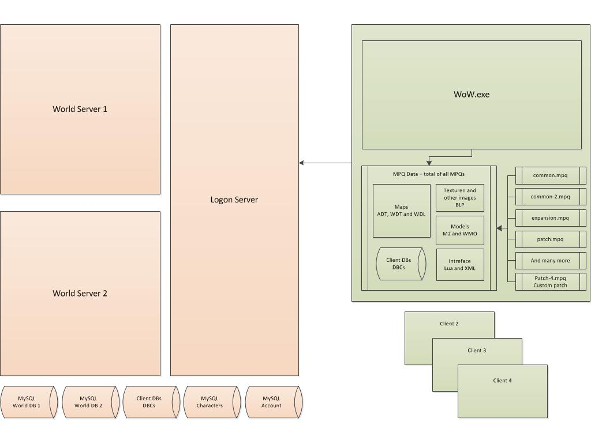

# Client Server architecture #

World of Warcraft is an online game. This means that you need 2 pieces of software to run it. The client you have installed as a player on your local pc and a server to connect the clients and deliver some content that is not included in the client.

Below you see an image where I show abstracted all the different parts of this 2 software systems that you can change to modify the game. But don´t panic if you now don´t understand all of this. We will explain the parts if we handle them.

# The MPQ files #
All WoW client data is stored in MPQ files. You can find them in the folder

    WoWFolder/data

And also in the local sub folder. This folder is named with your language code. Like deDE, enUS, enGB, ruRU or frFR. This files are archives like ZIP or RAR. They contain all the files the game need. Like models, the maps or textures. 

Blizzard use several own file types where you need special applications to edit them. But also mp3 or simple text files for Lua and XML code. In the following I will explain some files you will find in the MPQs.

So to mod WoW you have to extract the files, edit them and pack them again in MPQs so the client will load them. We will show you during the tutorial how this works.

# Common WoW file types #

The following list shows you some WOW file types and explain what they are for.

* **BLP** - Blizzard Picture is Blizzards own image format. You find texture, maps and interface elements with this type.
* **DBC** - Database Client files store the data for the client. You can think about them like excel files. You have rows and columns of data describing many things. For Example what maps you have or the races, spells and much more.
* **LUA** - Are script files in the language Lua that defines the actions for the interface. Like what happen if you click the login button.
* **XML** - These files define the look of the interface. It places images, models and UI elements.
* **M2** - Models like creatures, trees and other small stuff.
* **SKIN** - Texture information for M2s
* **WMO** - Word Models are bigger models like houses, bridges or full cities and dungeons like Stormwind or Deadmines.
* **ADT** - A map tile of a map like Azeroth. Every map can have 64 x 64 tiles in full size.
* **WDT** - A map definition file. It defines if and what ADTs on the map exist or if the map is build only out of one WMO like instances.
* **WDL** - A low res height map of all ADTs of the map. This file is used to display fare away mountains.
* **Wav/mp3** - Sound like for music and effects.

# Some words about DBC editing #
DBCs are data files including information for the client or the server in data form. You can think about them like excel tables. Every DBC is a big list of information like how the ground is named you are standing on, what weather set is located in the area you are or what spell´s exist.

In many cases you also have to copy your DBCs to the server you are using. Many times the server takes the information it gets from the client and compares them with the values in his DBCs. So if for example a spell is different in the client and in the server DBC, it will just not work.

We will have to edit DBCs during many tasks of modding. Perhaps just have a look at them to get a feeling and an overview what they are.

Open the MyDBCEditor from

    F:\WoWModding\Tools\MyDbcEditor\MyDbcEditor.exe

MENU > File > Open

Navigate to

    F:\WoWModding\ClientFiles\DBFilesClient

Open the file map.dbc

Here you see the list of all maps you have in wow. 
